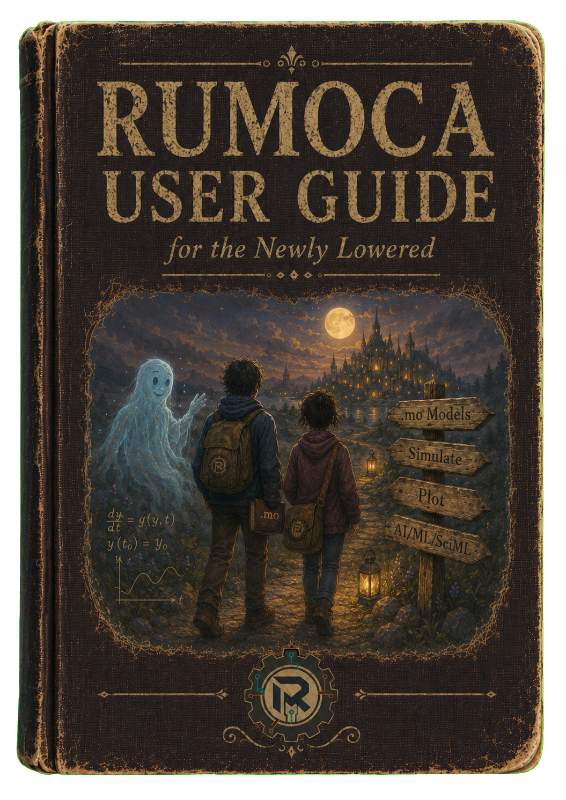

<p align="center">
  
</p>

Rumoca is a Modelica compiler, simulator, and code generation toolkit written
in Rust. It takes equation-based models of physical systems and turns them
into simulations you can run from the command line, VS Code, or a browser —
or into code for other ecosystems such as Python (SymPy, JAX, CasADi), C,
Rust, and FMI.

## What is Modelica?

[Modelica](https://modelica.org) is an open, equation-based language for
modeling physical systems. Instead of writing step-by-step simulation code,
you declare the equations that govern your system and let the compiler decide
how to solve them.

The example below is a small hot-air-balloon model. It is **live**: edit the
code, press **▶ Simulate** to integrate it right here in your browser, or
**Show DAE** to see the equation system the compiler produces. The editor has
the same syntax highlighting, completion, and error checking as the Rumoca
VS Code extension, powered by the same compiler running in WebAssembly.

```modelica,interactive
model HotAirBalloon "Hot-air balloon warmed by a burner"
  parameter Real m = 320.0 "Balloon, basket, and passenger mass [kg]";
  parameter Real g = 9.81 "Gravity [m/s2]";
  parameter Real Tamb = 293.15 "Ambient air temperature [K]";
  parameter Real tau = 35.0 "Envelope cooling time constant [s]";
  parameter Real burnerHeat = 0.8 "Temperature rise from burner [K/s]";
  parameter Real liftPerKelvin = 130.0 "Buoyant lift per kelvin [N/K]";
  parameter Real drag = 240.0 "Vertical drag [N.s/m]";
  parameter Real targetHeight = 30.0 "Altitude where the burner switches off [m]";
  parameter Real fuelBurnTime = 28.0 "Fuel burn time with burner fully on [s]";
  Real h(start = 2.0) "Altitude [m]";
  Real v(start = 0.0) "Vertical speed [m/s]";
  Real T(start = 320.0) "Envelope air temperature [K]";
  Real fuel(start = 1.0) "Fuel fraction";
  Real fuelPercent "Fuel remaining [%]";
  Real burner "Burner command";
equation
  burner = if fuel > 0.0 then if h < targetHeight then 1.0 else 0.0 else 0.0;
  fuelPercent = if fuel > 0.0 then 100.0 * fuel else 0.0;
  der(fuel) = if burner > 0.0 then -1.0 / fuelBurnTime else 0.0;
  der(T) = burnerHeat * burner - (T - Tamb) / tau;
  der(h) = if h > 0.0 then v else if v > 0.0 then v else 0.0;
  m * der(v) = liftPerKelvin * (T - Tamb) - m * g - drag * v;
  annotation(experiment(StopTime = 70.0, Interval = 0.1, Solver = "rk-like"));
end HotAirBalloon;
```

```js,rumoca-viz
// Render the balloon state as a small Three.js scene.
api.plotSeries(['h', 'fuelPercent']);
const { THREE } = await api.loadThree();
const h = api.series('h');
const fuel = api.series('fuel');
const burner = api.series('burner');

container.classList.add('rumoca-live-surface');
const host = document.createElement('div');
host.className = 'rumoca-live-surface-host';
container.appendChild(host);

const renderer = new THREE.WebGLRenderer({ antialias: true, preserveDrawingBuffer: true });
renderer.setPixelRatio(Math.min(window.devicePixelRatio || 1, 2));
renderer.setClearColor(0x8fd4ff, 1);
renderer.outputColorSpace = THREE.SRGBColorSpace;
host.appendChild(renderer.domElement);

const scene = new THREE.Scene();
scene.fog = new THREE.Fog(0x9fd5f1, 16, 42);
const camera = new THREE.PerspectiveCamera(42, 1, 0.1, 80);
camera.position.set(0, 4.2, 13.0);

scene.add(new THREE.HemisphereLight(0xfff2d4, 0x5a8a55, 1.6));
const sunLight = new THREE.DirectionalLight(0xffcc83, 2.4);
sunLight.position.set(5, 8, 4);
scene.add(sunLight);

const sun = new THREE.Mesh(
  new THREE.SphereGeometry(0.55, 32, 16),
  new THREE.MeshBasicMaterial({ color: 0xffe08a, fog: false })
);
sun.position.set(5.8, 5.2, -8);
scene.add(sun);

const ground = new THREE.Mesh(
  new THREE.PlaneGeometry(50, 35),
  new THREE.MeshStandardMaterial({ color: 0x7db35c, roughness: 0.9 })
);
ground.rotation.x = -Math.PI / 2;
ground.position.set(0, -2.4, -7);
scene.add(ground);

for (const [x, z, sx, sy, color] of [
  [-8, -13, 5.4, 1.5, 0x5f9461],
  [2, -14, 7.0, 1.9, 0x6fa76b],
  [10, -12, 4.8, 1.3, 0x8ab86e],
]) {
  const hill = new THREE.Mesh(
    new THREE.SphereGeometry(1, 24, 12),
    new THREE.MeshStandardMaterial({ color, roughness: 0.95, flatShading: true })
  );
  hill.scale.set(sx, sy, 2);
  hill.position.set(x, -2.0, z);
  scene.add(hill);
}

let randomSeed = 9;
function rand() {
  randomSeed = (randomSeed * 1664525 + 1013904223) >>> 0;
  return randomSeed / 4294967296;
}

function cloud(x, y, z, scale) {
  const group = new THREE.Group();
  const material = new THREE.MeshStandardMaterial({
    color: 0xffffff,
    roughness: 0.8,
    transparent: true,
    opacity: 0.82,
  });
  const puffCount = 5 + Math.floor(rand() * 4);
  for (let i = 0; i < puffCount; i++) {
    const puff = new THREE.Mesh(
      new THREE.SphereGeometry(0.55 + rand() * 0.55, 24, 16),
      material
    );
    puff.position.set((rand() - 0.5) * 1.7, (rand() - 0.35) * 0.45, (rand() - 0.5) * 0.35);
    puff.scale.set(1.0 + rand() * 0.9, 0.58 + rand() * 0.35, 0.82 + rand() * 0.45);
    group.add(puff);
  }
  group.position.set(x, y, z);
  group.scale.setScalar(scale);
  group.userData.speed = 0.0014 + rand() * 0.003;
  scene.add(group);
  return group;
}
const clouds = [];
for (let i = 0; i < 7; i++) {
  clouds.push(cloud(-7 + rand() * 14, 3.0 + rand() * 2.5, -4.5 - rand() * 5.5, 0.32 + rand() * 0.42));
}

function envelopeTexture() {
  const canvas = document.createElement('canvas');
  canvas.width = 512;
  canvas.height = 256;
  const ctx = canvas.getContext('2d');
  const colors = ['#2453d6', '#ffe2bd', '#2d60d8', '#ffd8aa'];
  const stripeWidth = canvas.width / 10;
  for (let i = 0; i < 10; i++) {
    const grad = ctx.createLinearGradient(i * stripeWidth, 0, (i + 1) * stripeWidth, 0);
    grad.addColorStop(0, '#173b9d');
    grad.addColorStop(0.16, colors[i % colors.length]);
    grad.addColorStop(0.58, colors[i % colors.length]);
    grad.addColorStop(1, '#173b9d');
    ctx.fillStyle = grad;
    ctx.fillRect(i * stripeWidth, 0, stripeWidth + 1, canvas.height);
  }
  ctx.globalAlpha = 0.28;
  ctx.fillStyle = '#ffffff';
  ctx.fillRect(canvas.width * 0.74, canvas.height * 0.12, 18, canvas.height * 0.52);
  ctx.globalAlpha = 1.0;
  const texture = new THREE.CanvasTexture(canvas);
  texture.colorSpace = THREE.SRGBColorSpace;
  return texture;
}

const balloon = new THREE.Group();
scene.add(balloon);

const envelopeProfile = [
  [0.14, 0.0],
  [0.44, 0.12],
  [0.72, 0.38],
  [1.08, 0.82],
  [1.55, 1.5],
  [2.02, 2.32],
  [2.3, 3.1],
  [2.24, 3.72],
  [1.9, 4.28],
  [1.3, 4.72],
  [0.62, 5.0],
  [0.06, 5.08],
].map(([radius, y]) => new THREE.Vector2(radius, y));
const envelope = new THREE.Mesh(
  new THREE.LatheGeometry(envelopeProfile, 160),
  new THREE.MeshStandardMaterial({ map: envelopeTexture(), roughness: 0.55 })
);
balloon.add(envelope);

const throat = new THREE.Mesh(
  new THREE.TorusGeometry(0.45, 0.08, 12, 40),
  new THREE.MeshStandardMaterial({ color: 0x1743b8, roughness: 0.6 })
);
throat.rotation.x = Math.PI / 2;
throat.position.y = 0.14;
balloon.add(throat);

const basketMaterial = new THREE.MeshStandardMaterial({ color: 0x8a5429, roughness: 0.8 });
const basket = new THREE.Mesh(new THREE.BoxGeometry(0.9, 0.55, 0.65), basketMaterial);
basket.position.y = -0.45;
balloon.add(basket);

const ropeMaterial = new THREE.LineBasicMaterial({ color: 0x463021 });
for (const x of [-0.38, 0.38]) {
  for (const z of [-0.28, 0.28]) {
    balloon.add(new THREE.Line(
      new THREE.BufferGeometry().setFromPoints([
        new THREE.Vector3(x, -0.16, z),
        new THREE.Vector3(x * 1.25, 0.2, z * 1.25),
      ]),
      ropeMaterial
    ));
  }
}

const flameLight = new THREE.PointLight(0xff7a1a, 0, 3.0);
flameLight.position.set(0, 0.38, 0);
balloon.add(flameLight);
const flame = new THREE.Mesh(
  new THREE.ConeGeometry(0.14, 0.45, 24),
  new THREE.MeshBasicMaterial({ color: 0xff7a1a, transparent: true, opacity: 0.85 })
);
flame.rotation.x = Math.PI;
flame.position.y = 0.38;
balloon.add(flame);

function bird(x, y, z, phase) {
  const positions = new Float32Array([
    0, 0, 0.5, 1.2, 0, 0, 0, 0, -0.5,
    0, 0, -0.5, -1.2, 0, 0, 0, 0, 0.5,
  ]);
  const geometry = new THREE.BufferGeometry();
  geometry.setAttribute('position', new THREE.BufferAttribute(positions, 3));
  geometry.computeBoundingSphere();
  const mesh = new THREE.Mesh(
    geometry,
    new THREE.MeshBasicMaterial({ color: 0xffffff, side: THREE.DoubleSide })
  );
  mesh.position.set(x, y, z);
  mesh.scale.setScalar(0.18 + rand() * 0.08);
  mesh.rotation.y = Math.PI * 0.5;
  mesh.userData = {
    homeX: x,
    homeY: y,
    phase,
    speed: 0.011 + rand() * 0.007,
    drift: 0.12 + rand() * 0.18,
    positions,
  };
  scene.add(mesh);
  return mesh;
}
const birds = [];
for (let i = 0; i < 9; i++) {
  birds.push(bird(-4.5 + rand() * 9, 3.9 + rand() * 1.5, -7.5 + rand() * 2.5, rand() * Math.PI * 2));
}

function resize() {
  const width = Math.max(320, Math.floor(host.clientWidth || 720));
  const height = Math.max(320, Math.min(520, Math.floor(width * 0.58)));
  renderer.setSize(width, height, false);
  camera.aspect = width / height;
  camera.updateProjectionMatrix();
}
new ResizeObserver(resize).observe(host);
resize();

api.addAnimation(times, (frame) => {
  const t = times[frame];
  const altitude = Math.max(0, h[frame] || 0);
  const burn = Math.max(0, Math.min(1, burner[frame] || 0));
  const fuelPercent = Math.max(0, Math.min(100, Math.round((fuel[frame] || 0) * 100)));
  balloon.position.set(0.5 * Math.sin(t * 0.16), -1.2 + altitude / 18, 0);
  balloon.rotation.z = burn * 0.05 * Math.sin(t * 0.8);
  envelope.scale.set(1 + burn * 0.02, 1 + burn * 0.03, 1 + burn * 0.02);
  flame.visible = burn > 0.12;
  flame.scale.setScalar(0.8 + burn * 0.8);
  flameLight.intensity = burn > 0.12 ? 2.0 + burn * 5.0 : 0;

  for (let i = 0; i < clouds.length; i++) {
    clouds[i].position.x += clouds[i].userData.speed;
    if (clouds[i].position.x > 7) clouds[i].position.x = -7;
  }
  for (let i = 0; i < birds.length; i++) {
    const bird = birds[i];
    bird.position.z += bird.userData.speed;
    if (bird.position.z > -2.0) bird.position.z = -8.0 - rand() * 1.5;
    bird.position.x = bird.userData.homeX + Math.sin(t * 0.7 + bird.userData.phase) * bird.userData.drift;
    bird.position.y = bird.userData.homeY + Math.sin(t * 1.1 + bird.userData.phase) * 0.08;
    const flap = Math.sin((bird.position.z + t) * 5.2 + bird.userData.phase) * 0.85;
    bird.userData.positions[4] = flap;
    bird.userData.positions[13] = flap;
    bird.geometry.attributes.position.needsUpdate = true;
  }

  camera.lookAt(balloon.position.x, balloon.position.y + 2.2, balloon.position.z);
  renderer.render(scene, camera);
  return `t = ${api.formatTick(times[frame])} s · fuel ${fuelPercent}%`;
}, 8000);
```

Note what you did *not* have to write: no integration loop, no state vector
bookkeeping, no event logic. `der(h)` means the time derivative of `h`, and
the compiler transforms the equations into a form a numerical solver can
integrate.

## What Rumoca Gives You

| Capability | Where to read more |
|---|---|
| Compile and simulate Modelica models | [Quick Start](./getting-started/quickstart.md), [Running Simulations](./simulation/running.md) |
| Repeatable scenario files (`rumoca-scenario.toml`) for simulation and codegen | [Scenario Files](./simulation/scenario-tomls.md) |
| Interactive, human-in-the-loop simulation with browser 3D viewers | [Interactive Simulation](./simulation/interactive.md) |
| Code generation to SymPy, JAX, CasADi, C, Rust, FMI, and more | [Targets and Templates](./codegen/targets.md) |
| IDE support: diagnostics, completion, hover, run buttons | [VS Code Extension](./tools/vscode.md) |
| Formatter and linter for Modelica source | [Formatter and Linter](./tools/fmt-lint.md) |
| Full compiler in WebAssembly | [Web Playground](./tools/playground.md) |
| Structural analysis and debugging of models | [Inspecting and Debugging Models](./simulation/inspect.md) |

## The Normal Workflow

1. Write or open a Modelica model (`.mo` file).
2. Configure any external Modelica package roots, such as the Modelica
   Standard Library (MSL).
3. Run a direct command (`rumoca sim model.mo`) or a colocated `rumoca-scenario.toml`
   scenario (`rumoca sim -c rumoca-scenario.toml`).
4. Inspect results in the CLI, VS Code, the browser viewer, or generated
   target output.

## Project Status

Rumoca is in active development. It compiles and simulates a growing subset
of Modelica, validated continuously against the Modelica Standard Library,
but it is not yet a complete replacement for mature tools such as
OpenModelica or Dymola. See [Language Support
Status](./language/support-status.md) for an honest description of what works
today.

## How This Book Is Organized

- **Getting Started** installs Rumoca and walks you through your first model.
- **The Modelica Language** explains equation-based modeling and what Rumoca
  supports.
- **Tools** covers the CLI, VS Code extension, playground, formatter, and
  linter.
- **Simulation** covers direct runs, scenario files, solvers, interactive
  simulation, and debugging.
- **Code Generation** covers built-in and custom targets.

Developers who want to understand or modify the compiler itself should read
the companion [Rumoca Dev Guide](https://cognipilot.github.io/rumoca/dev-guide/)
book.
