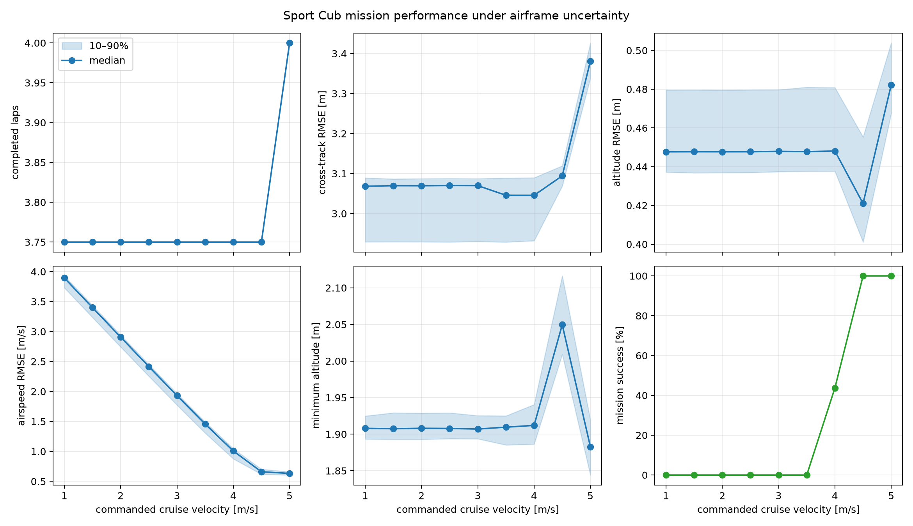
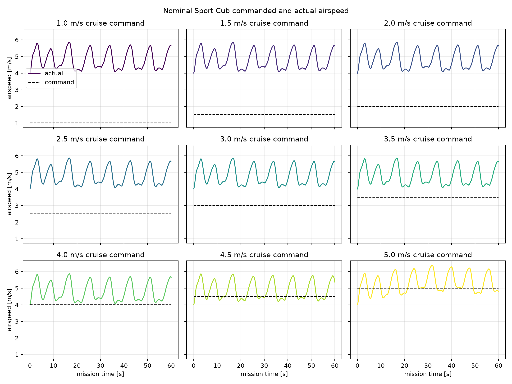
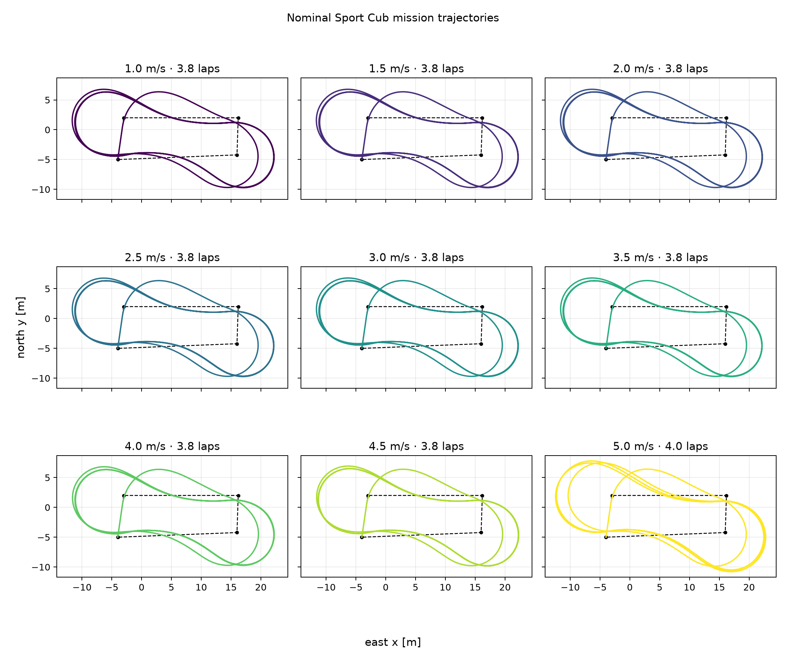

# Sport Cub firmware Monte Carlo

This is a pure-Python Monte Carlo mission example for the HobbyZone Sport Cub
S2. It sweeps commanded cruise velocity from **1 m/s through 5 m/s in 0.5 m/s
steps** and writes both the raw trial metrics and publication-ready figures.

`sport_cub_firmware.py` exposes one public closed-loop model,
`SportCubFirmwareModel`, composed of:

- the identified CUBS2 6-DOF Sport Cub aerodynamic model;
- the onboard HobbyZone SAFE attitude/rate stabilizer approximation; and
- the 50 Hz `FixedWingOuterLoop` state update from the firmware source of truth,
  `cerebri_cubs2/src/FixedWingOuterLoop.mo`, at commit
  `e25c108fc2c4762fda8303594b82eb8ddccee0ad`.

The closed-loop signal path is:

```text
Zephyr FixedWingOuterLoop → PWM/SAFE receiver behavior → 6-DOF Sport Cub physics
             ↑                                            │
             └────────────── pose feedback ────────────────┘
```

`monte_carlo.py` only creates parameter draws and calls this model; it does not
contain another controller or airframe implementation. The aileron/elevator
polarities match `cerebri_cubs2/src/main.c`, which maps the generated controller
outputs onto the physical receiver channels.

The controller gains, TECS limits, estimator, and waypoint logic are kept
together in that model. The example configures a closed four-waypoint circuit:
`(-4,-5) → (-3,2) → (16.2,2) → (16,-4.22) → (-4,-5)`, at 3 m altitude.
`SportCubFirmwareMission.mo` is the single-source Modelica comparison model; it
is not invoked by the Monte Carlo runner. The Python implementation is used for
the sweep so hundreds of 60 s missions do not pay Rumoca's interpreted solver
cost on every trial.

The outer-loop attitude gains are exposed as `FirmwareParameters` fields so a
software/controller change can be separated from an airframe change. Their
defaults preserve the original controller constants.

## Run

From this directory, using the examples environment:

```bash
../../.venv/bin/python monte_carlo.py
```

The defaults run 16 trials at each of the 9 velocities for a 60 s mission. Use
a small smoke run while editing:

```bash
../../.venv/bin/python monte_carlo.py \
  --samples 2 --duration 10 --workers 2 --output-dir /tmp/sport-cub-smoke
```

The script writes:

- `figures/mission_trajectories.png` — nominal route and trajectory at every
  commanded velocity;
- `figures/airspeed_tracking.png` — commanded and actual nominal airspeed at
  every commanded velocity;
- `figures/mission_performance.png` — median and 10–90% mission metrics; and
- `figures/mission_performance.csv` — one row per Monte Carlo trial.

The checked-in 16-trial, seed-7 sweep produced:

| Cruise command | Success | Median actual airspeed | Median airspeed RMSE | Median cross-track RMSE |
|---:|---:|---:|---:|---:|
| 1.0 m/s | 0% | 4.86 m/s | 3.89 m/s | 3.07 m |
| 1.5 m/s | 0% | 4.86 m/s | 3.40 m/s | 3.07 m |
| 2.0 m/s | 0% | 4.86 m/s | 2.91 m/s | 3.07 m |
| 2.5 m/s | 0% | 4.86 m/s | 2.42 m/s | 3.07 m |
| 3.0 m/s | 0% | 4.86 m/s | 1.93 m/s | 3.07 m |
| 3.5 m/s | 0% | 4.86 m/s | 1.46 m/s | 3.05 m |
| 4.0 m/s | 44% | 4.86 m/s | 1.01 m/s | 3.05 m |
| 4.5 m/s | 100% | 4.91 m/s | 0.66 m/s | 3.09 m |
| 5.0 m/s | 100% | 5.32 m/s | 0.63 m/s | 3.38 m |

Every trial completed the 60 s route without ground impact. The median was 3.75
circuits through 4.5 m/s and 4.00 circuits at 5.0 m/s. The success transition is
therefore driven by airspeed tracking: this firmware/airframe combination
remains near its natural 4–5 m/s operating range rather than slowing to the
lower commands.

The overlapping low-speed cases are controller behavior, not a disconnected
Monte Carlo parameter. The firmware first computes
`K_V * (vCruise - abs(v_est))`, then clips that request between
`-envelopeDrag / weight` and `(thrustMax - envelopeDrag) / weight`. With the
deployed parameters, every requested acceleration is limited to approximately
`[-0.113, 0.372]`. The firmware also estimates acceleration as the filtered
per-sample speed difference without dividing by `dt`; the Python model retains
both details so it represents the deployed controller rather than correcting
it inside the study.







## Monte Carlo definition

Trial zero is nominal. The remaining trials use common random numbers across
all cruise velocities and independently perturb:

| Quantity | Distribution (1 sigma) |
|---|---:|
| mass | 4% |
| lift-curve slope `CLa` | 6% |
| parasitic drag `CD0` | 10% |
| maximum thrust | 5% |
| initial airspeed about 4 m/s | 0.15 m/s |
| initial heading | 2 degrees |

The mission starts airborne at 3 m at the first of the four waypoints, aligned
with the first route leg. This keeps the study focused on cruise guidance
instead of conflating low cruise commands with ground-roll and launch
performance. A trial succeeds when it completes the requested duration,
completes at least one route circuit, stays above the ground, and holds airspeed
RMSE within `max(0.5 m/s, 25% of the command)`.

This remains a simulation study: wind, mocap dropouts, actuator dynamics, and
ground contact are outside its scope.

## Autopilot gain sweeps

`autopilot_gain_sweep.py` is a separate entry point; `monte_carlo.py` and its
existing output remain unchanged. It performs an attributable, one-at-a-time
firmware-gain sweep at the nominal 4 m/s cruise command. For example:

```bash
../../.venv/bin/python autopilot_gain_sweep.py \
  --parameter pitch_attitude_kp --output figures/pitch_attitude_kp.csv
```

The predefined scale set includes nominal, zero, positive multiples, and
negative sign/configuration errors. Run `--help` for the named TECS, guidance,
and attitude parameters. Physical uncertainty draws use the same seed and are
reused at every scale.

Each CSV row records the root random seed, requested duration, parameter name,
nominal value, scale, applied value, and all baseline mission metrics.
`failure_mode` and `time_to_failure_s` report
hard outcomes directly evidenced by the trace: `ground_impact`, sustained
stall for at least 1 s, unsafe roll beyond 90 degrees or pitch beyond 60
degrees for at least 0.5 s, `non_finite_state`, or `early_termination`. The CSV
also records maximum roll, pitch, and angle of attack plus stall and actuator
saturation fractions. These thresholds are study assumptions for screening,
not validated limits for the onsite aircraft. A completed but poorly tracking
mission remains a degradation in the baseline metrics rather than being called a
crash. Blank failure time with `failure_mode=none` means no hard failure was
observed during the requested duration.

The runner writes a PNG beside the CSV unless `--plot` selects another path.
Every physical-uncertainty trial appears as a faint line across gain scale;
the median and 10–90% band summarize the Monte Carlo response. A dashed line
marks the nominal `1x` gain, and the final panel separates mission-tracking
success from hard failures.

After the one-at-a-time studies identify a sensitive region,
`autopilot_gain_interaction_sweep.py` runs the focused pitch-attitude Kp x Ki
grid. Its defaults cover Kp scales `1, 2, 4, 10` and Ki scales
`1, 2, 4, 6, 8, 10`, with 16 common-random physical trials per gain pair:

```bash
../../.venv/bin/python autopilot_gain_interaction_sweep.py --workers 4
```

The interaction runner writes the raw CSV, an annotated response-surface
dashboard, and a profile figure with median and 10–90% Monte Carlo bands.
Percentage heatmaps use a fixed 0–100% scale so success, hard failures, and
saturation remain visually comparable between studies.

`failure_campaign_sweep.py` contains two focused crash-envelope campaigns.
The SAFE study varies the low-speed protection threshold and forced-dive slope;
the physical study varies actual thrust and physical mass while leaving the
controller assumptions nominal:

```bash
../../.venv/bin/python failure_campaign_sweep.py \
  --campaign safe_protection --workers 4
../../.venv/bin/python failure_campaign_sweep.py \
  --campaign thrust_mass --workers 4
```

Each campaign writes an annotated dashboard containing hard-failure
probability, median time to failure, minimum altitude, tracking error, angle of
attack, and elevator saturation. SAFE `protection_high` is kept exactly 1 m/s
above the swept `protection_low`, preserving a valid protection ramp while its
absolute operating range changes. In the physical campaign, Monte Carlo
airframe draws are applied first and the deterministic mass/thrust scale is
then applied, so every CSV row records the actual resulting plant values.

`velocity_boundary_sweep.py` tests whether the selected failure boundaries
depend on commanded cruise speed. It uses commands `2, 3, 4, 5, 6 m/s` and
reuses identical physical Monte Carlo draws across all velocities and boundary
conditions:

```bash
../../.venv/bin/python velocity_boundary_sweep.py --workers 4
```

The combined CSV identifies the campaign and boundary condition on every row.
Separate annotated dashboards are written for altitude feedback, SAFE
protection, and physical thrust-to-mass conditions. The selected boundaries
are intentionally focused rather than a Cartesian product of every parameter:
four altitude-gain settings, four SAFE threshold/slope settings, and twelve
mass/thrust settings.

For the disabled-altitude-feedback boundary, the aggregate heatmap is
supplemented by a trajectory-level crash visualization:

```bash
../../.venv/bin/python velocity_crash_visualization.py --workers 4
```

The left panel shows median altitude and 10–90% Monte Carlo bands at every
cruise command. Impacted trajectories are held at zero altitude after impact
so later percentiles are not biased toward survivors. The right panel shows
the corresponding empirical fraction of aircraft still airborne over time.
